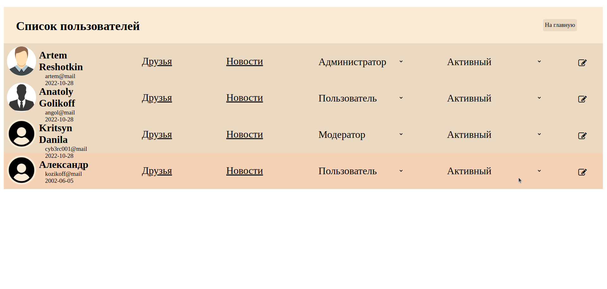
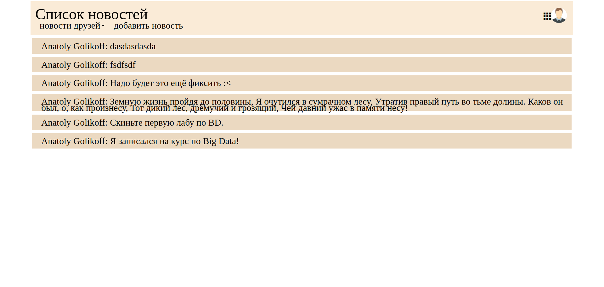
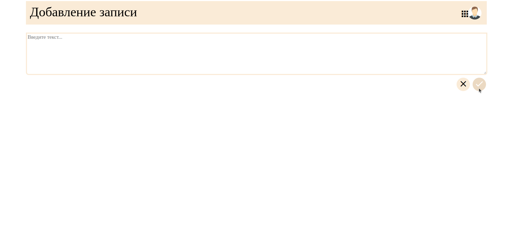
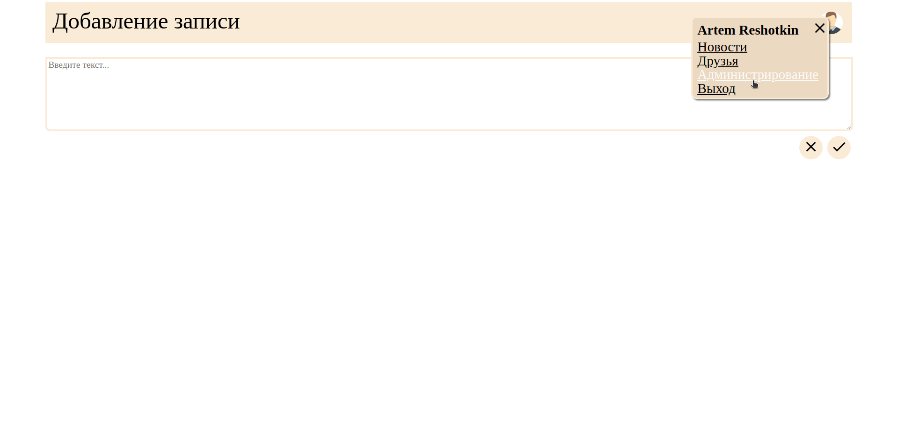

# mini-social-network-module
Небольшое web-приложение социальной сети, включающее 2 модуля: модуль администратора и модуль пользователя.  
**Приложение реализует минимальный функционал:** 
+ Возможность регистрации
+ Авторизации пользователей (благодаря LoginGuard)
+ Возможность создавать и просматривать новости (благодаря socket.io реализовано автоматическое обновление ленты).

**Модуль администратора включает функционал по управлению аккаунтами пользователей:**
+ Просмотра новостной ленты 
+ Изменение ролей 
+ Редактирование информации.
## Модуль администрирования
### Backend:
+ В качестве сервера используется Node.JS и модуль Express.
### Frontend
+ Сборка фронтэнда осуществляется с помощью GULP. 
+ Используется библиотека jQuery.
+ Стили задатся с помощью LESS.
+ Иконки: font-awesome.
+ Разметка задаётся с помощью Pug.
## Модуль клиента
### Backend:
+ Сервер: Node.JS и модуль Express.
+ Сокеты: Socket.IO
+ Тестирование: Jest
### Frontend:
+ Angular
## Пример:

